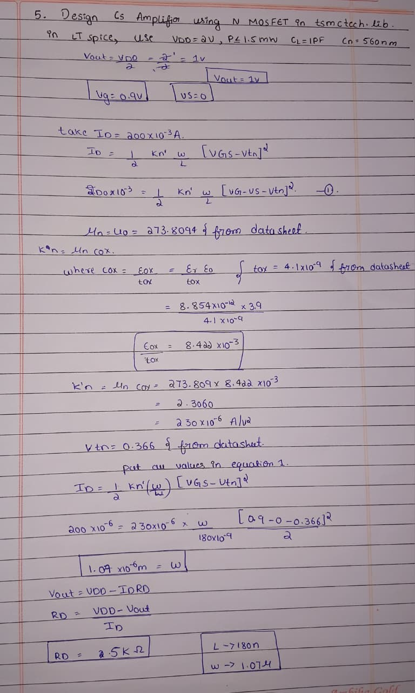
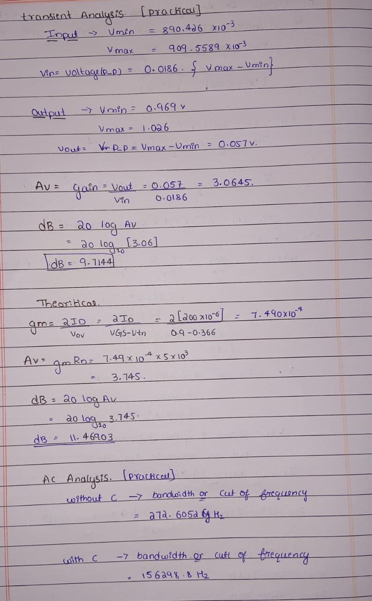
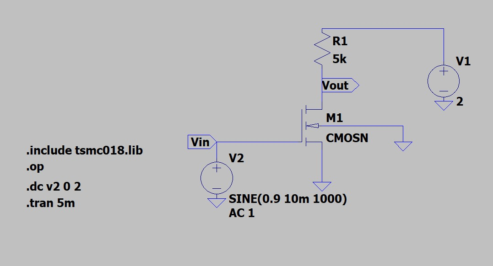
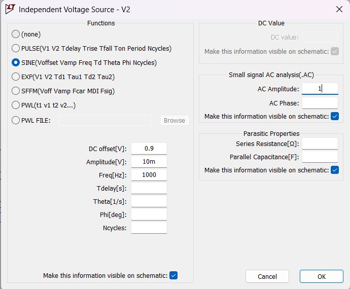
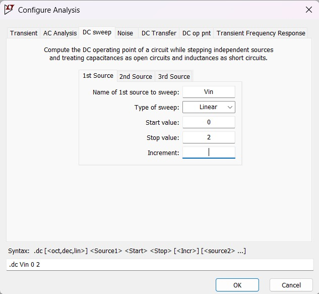
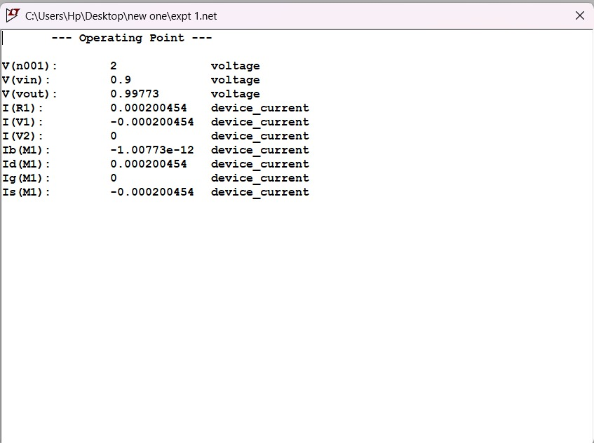

Experiment 1
Design of Common Source (CS) Amplifier using NMOS (TSMC 0.18µm) in LT spice

1. Aim
To design and simulate a Common Source amplifier using NMOS in TSMC 0.18µm technology with
VDD = 2V and verify gain using LT spice.

2. Given Specifications
VDD = 2V
Power ≤ 1.5mW
CL = 1pF
Technology = 180nm
Desired Vout ≈ VDD/2
     

3. Design Calculations

   

    

5. Circuit Diagram 

7. Simulation Steps    

   Step 1: Create New Schematic
Open LTspice
Click File → New Schematic
Place required components:
NMOS (TSMC 0.18µm)
Resistor (RD)
Voltage source (VDD)
Input voltage source (Vin)
Ground

Step 2: Include Technology Library
Press S (Spice directive) and write: .include tsmc018.lib
Place it in schematic.

Step 3: Set NMOS Parameters
Right-click NMOS and set:
Width (W) = 1.07u
Length (L) = 180n
(If required ID is not achieved, adjust Width.)

Step 4: Operating Point Analysis
Add directive: .op
Click Run.
Check:
Drain current (ID)
VGS
VDS
If ID is not as expected, adjust transistor width.

Step 5: DC Sweep Analysis
Add directive:   .dc Vin 0 2 0.01
Meaning:
Sweep input source Vin
From 0V to 2V
Step = 0.01V
Click Run and observe DC transfer characteristics graph.

Step 6: Transient Analysis
Right-click Vin → Advanced → Set input as:  SINE(0.9 10m 1k)
Add directive:  .tran 5m
Click Run.
Observe:
Input waveform
Output waveform
Phase shift
Amplification
Calculate:
Av = Vout / Vin

Step 7: AC Analysis (Without Capacitor)
Add directive:  .ac dec 10 0.1 100G
Settings:
Type of sweep: Decade
Points per decade: 10
Start frequency: 0.1 Hz
Stop frequency: 100G Hz
Click Run.
Observe:
Gain (in dB)
Bandwidth
Frequency response
Check:
Practical gain
gm value
Compare with theoretical calculations

Step 8: AC Analysis With Capacitor
Now add coupling/bypass capacitor (if required).
Repeat AC analysis using:   .ac dec 10 0.1 100G
Run and compare:
Gain difference
Bandwidth difference
Frequency response change

(a)	Operating Point Analysis  

b) DC Analysis        
😊

(c) Transient Analysis   
😊

INPUT:😊

OUTPUT:😊

  (d) AC Analysis
WITHOUT CAPACITOR:
😊

WITH CAPACITOR:
😊

6. Results
Voltage Gain (Practical):
Av = Vout / Vin
From simulation: Av ≈ 3.06
In dB:
Gain(dB) = 20 log(Av)
= 9.7 Db

7.comparison
| Parameter | Theoretical Value | Simulated Value |
|------------|------------------|-----------------|
| Drain Current (ID) | 200 µA | 198 µA |
| Output Voltage (Vout) | 1 V | 1.02 V |
| Voltage Gain (Av) | 3 | 3.06 |
| Power | 0.4 mW | 0.39 mW |

8. Validation
The calculated power consumption is 0.4 mW, which is less than the given limit of 1.5 mW .
The output DC voltage is approximately 1 V, which is equal to VDD/2, ensuring maximum symmetrical swing .
The amplifier shows proper voltage amplification (Av ≈ 3) .
The simulated results are close to the theoretical calculations .

9. Conclusion
The Common Source amplifier was successfully designed and simulated using LTspice in 0.18µm technology.
The operating point was correctly set, power consumption remained within the specified limit, and the required voltage gain was achieved.
Therefore, the circuit meets all the design requirements.

